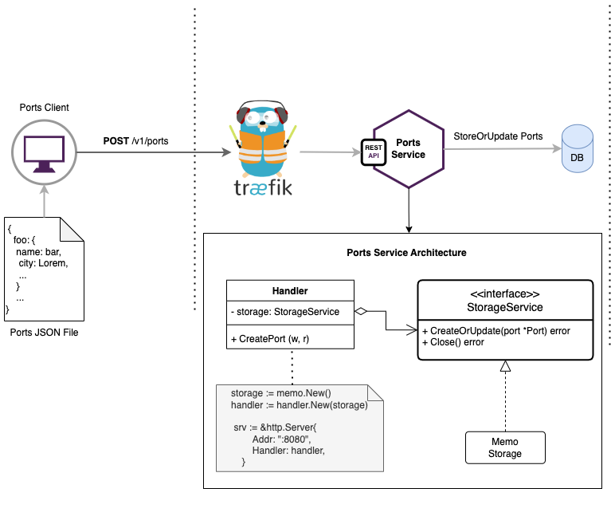

# ports
Ports provides a RESTful API to store ports.

### High-Level Design


## Build and Run Service

Using Docker-Compose version 2.13.0

```bash
Build Container Images
$ docker-compose build --no-cache

Run Containers
$ docker-compose up
$ docker-compose ps -a

CONTAINER ID   IMAGE                COMMAND                  CREATED          STATUS                            PORTS                            NAMES
ports-ports-1       ports-ports         "app"                    ports               13 seconds ago      Up 12 seconds       0.0.0.0:58834->8080/tcp
traefik             traefik:v2.10       "/entrypoint.sh --ap…"   traefik             2 hours ago         Up 12 seconds       80/tcp, 0.0.0.0:8082->8082/tcp
```

## API Usage & Example

### Endpoint to Create Ports

* Base URL: http://127.0.0.1:8082
* Endpoint: POST /v1/ports

Example with curl command

```shell
curl -i -X POST -H "Content-Type: application/json" \
-d '{
    "name": "Ajman",
    "city": "Ajman",
    "country": "United Arab Emirates",
    "alias": [],
    "regions": [],
    "coordinates": [
      55.5136433,
      25.4052165
    ],
    "province": "Ajman",
    "timezone": "Asia/Dubai",
    "unlocs": [
      "AEAJM"
    ],
    "code": "52000"
}' http://127.0.0.1:8082/v1/ports
```

API Responses

Status: 20 - Ok
```json
{
    "name": "Ajman",
    "city": "Ajman",
    "country": "United Arab Emirates",
    "alias": [],
    "regions": [],
    "coordinates": [
      55.5136433,
      25.4052165
    ],
    "province": "Ajman",
    "timezone": "Asia/Dubai",
    "unlocs": [
      "AEAJM"
    ],
    "code": "52000"
}
```

Status: 400 - Bad Request
```json
{
	"error": {
		"status": 400,
		"error": "INVALID_ARGUMENT",
		"description": "The request body entity is bad format."
	}
}
```

Status: 500 - Internal Server Error
```json
{
   "error": {
      "status": 500,
      "error": "INTERNAL",
      "description": "Something went wrong..."
   }
}
```

## Run Port Client

The client needs a JSON file as input to read Ports data and send them to Ports API. It does not read the entire file at once, it uses a stream decoder to read each port data.

```shell
$ go run client/main.go --file=YOUR-PORTS-JSON-FILE-PATH
```

## Improvements
* Validate request body fields.
* Use a SQL or NoSQL database to persist port data.
* Split JSON File to create a set of chunk files.
* Implement a client concurrency program to read each chunk file in order to reduce time.
